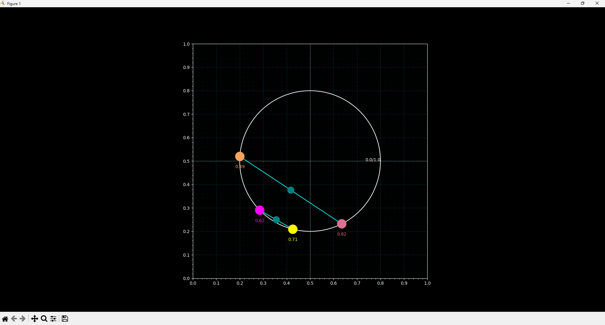
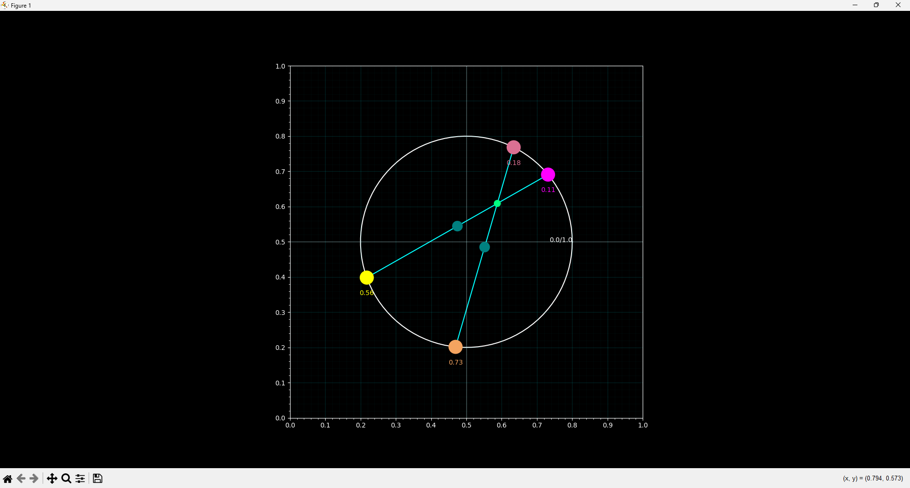

# Inscribed Rectangle Problem Visualization

Interactive visualization tool for exploring the Inscribed Rectangle Problem - a mathematical conjecture about rectangle inscribability in Jordan curves.

## Features
- Interactive closed loop with draggable points
- Color-coded vertices: yellow/magenta and sandybrown/palevioletred
- Cyan connection lines between vertex pairs
- Teal midpoint indicators
- Springgreen intersection point
- Dark background with turquoise grid and white center axes
- Real-time coordinate tracking (0.0-1.0)

## Requirements
- Python 3.x
- NumPy
- Matplotlib

## Usage
```python
python main.py
```

Drag points to explore possible rectangle configurations within the curve. The visualization shows coordinates, midpoints, and line intersections in real-time.

## Mathematical Context
Explores the conjecture that any continuous, simple closed curve contains four points forming a rectangle.

